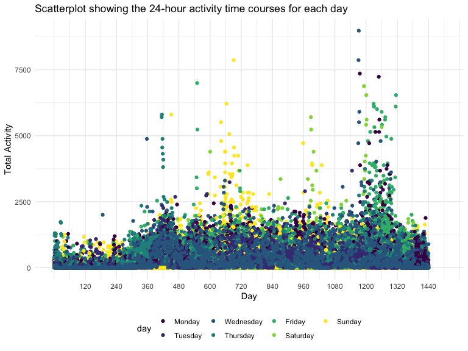
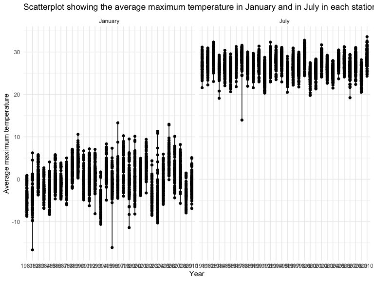
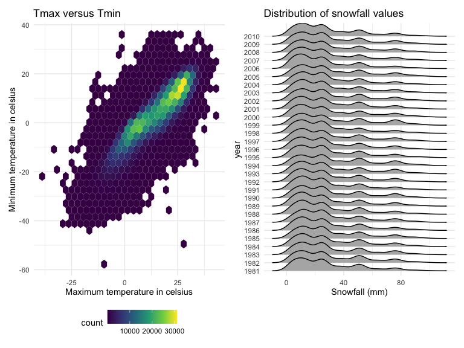

Homework 3 new
================
Kiran Kui
2022-10-17

# Problem 1

``` r
#Loading the Instacart data
library(p8105.datasets)
data("instacart")

instacart
```

    ## # A tibble: 1,384,617 × 15
    ##    order_id product_id add_to_…¹ reord…² user_id eval_…³ order…⁴ order…⁵ order…⁶
    ##       <int>      <int>     <int>   <int>   <int> <chr>     <int>   <int>   <int>
    ##  1        1      49302         1       1  112108 train         4       4      10
    ##  2        1      11109         2       1  112108 train         4       4      10
    ##  3        1      10246         3       0  112108 train         4       4      10
    ##  4        1      49683         4       0  112108 train         4       4      10
    ##  5        1      43633         5       1  112108 train         4       4      10
    ##  6        1      13176         6       0  112108 train         4       4      10
    ##  7        1      47209         7       0  112108 train         4       4      10
    ##  8        1      22035         8       1  112108 train         4       4      10
    ##  9       36      39612         1       0   79431 train        23       6      18
    ## 10       36      19660         2       1   79431 train        23       6      18
    ## # … with 1,384,607 more rows, 6 more variables: days_since_prior_order <int>,
    ## #   product_name <chr>, aisle_id <int>, department_id <int>, aisle <chr>,
    ## #   department <chr>, and abbreviated variable names ¹​add_to_cart_order,
    ## #   ²​reordered, ³​eval_set, ⁴​order_number, ⁵​order_dow, ⁶​order_hour_of_day

his dataset contains 1384617 rows and 15 columns, with each row
resprenting a single product from an instacart order.

Variables include:

-   order id
-   product id
-   add to cart order
-   reordered items
-   user id
-   evaluation set
-   order number
-   day of week that order was made
-   hour of day that order was made
-   days since last order
-   product name
-   aisle id
-   department id
-   aisle
-   department

One of the key variables is the product name purchased at instacart: for
instance, “shelled pistachios”, “spring water”.

Another key variable is the aisle that the product was purchased: for
instance, yoghurt, fresh vegetables, etc.

In total, there are 39123 products found in 131209 orders from 131209
distinct users.

``` r
instacart %>% 
  count(aisle) %>% 
  arrange(desc(n))
```

    ## # A tibble: 134 × 2
    ##    aisle                              n
    ##    <chr>                          <int>
    ##  1 fresh vegetables              150609
    ##  2 fresh fruits                  150473
    ##  3 packaged vegetables fruits     78493
    ##  4 yogurt                         55240
    ##  5 packaged cheese                41699
    ##  6 water seltzer sparkling water  36617
    ##  7 milk                           32644
    ##  8 chips pretzels                 31269
    ##  9 soy lactosefree                26240
    ## 10 bread                          23635
    ## # … with 124 more rows

I created a table summarizing the number of items ordered from aisle. In
total, there are 134 aisles.

``` r
instacart %>% 
  count(aisle) %>% 
  filter(n > 10000) %>% 
  mutate(aisle = fct_reorder(aisle, n)) %>% 
  ggplot(aes(x = aisle, y = n)) + 
  geom_point() + 
  labs(title = "Number of items ordered in each aisle") +
  theme(axis.text.x = element_text(angle = 60, hjust = 1))
```


I created a plot that shows the number of items ordered in each aisle.
Here, aisles are ordered by ascending number of items.

``` r
instacart %>% 
  filter(aisle %in% c("baking ingredients", "dog food care", "packaged vegetables fruits")) %>%
  group_by(aisle) %>% 
  count(product_name) %>% 
  mutate(rank = min_rank(desc(n))) %>% 
  filter(rank < 4) %>% 
  arrange(desc(n)) %>%
  knitr::kable()
```

| aisle                      | product_name                                  |    n | rank |
|:---------------------------|:----------------------------------------------|-----:|-----:|
| packaged vegetables fruits | Organic Baby Spinach                          | 9784 |    1 |
| packaged vegetables fruits | Organic Raspberries                           | 5546 |    2 |
| packaged vegetables fruits | Organic Blueberries                           | 4966 |    3 |
| baking ingredients         | Light Brown Sugar                             |  499 |    1 |
| baking ingredients         | Pure Baking Soda                              |  387 |    2 |
| baking ingredients         | Cane Sugar                                    |  336 |    3 |
| dog food care              | Snack Sticks Chicken & Rice Recipe Dog Treats |   30 |    1 |
| dog food care              | Organix Chicken & Brown Rice Recipe           |   28 |    2 |
| dog food care              | Small Dog Biscuits                            |   26 |    3 |

The three most popular items in aisles `baking ingredients`,
`dog food care`, and `packaged vegetables fruits`, and includes the
number of times each item is ordered.

``` r
instacart %>%
  filter(product_name %in% c("Pink Lady Apples", "Coffee Ice Cream")) %>%
  group_by(product_name, order_dow) %>%
  summarize(mean_hour = mean(order_hour_of_day)) %>%
  spread(key = order_dow, value = mean_hour) %>%
  knitr::kable(digits = 2)
```

    ## `summarise()` has grouped output by 'product_name'. You can override using the
    ## `.groups` argument.

| product_name     |     0 |     1 |     2 |     3 |     4 |     5 |     6 |
|:-----------------|------:|------:|------:|------:|------:|------:|------:|
| Coffee Ice Cream | 13.77 | 14.32 | 15.38 | 15.32 | 15.22 | 12.26 | 13.83 |
| Pink Lady Apples | 13.44 | 11.36 | 11.70 | 14.25 | 11.55 | 12.78 | 11.94 |

I created a table showing the mean hour of the day at which Pink Lady
Apples and Coffee Ice Cream are ordered on each day of the week.

# Problem 2

I read in, tidied and wrangled the dataset accel_data.csv

``` r
# Load, tidy and wrangle the data
accel_df <- read_csv("./data/accel_data.csv") %>%
  janitor::clean_names() %>% 
  drop_na(day_id) %>% 
  pivot_longer( 
     cols = activity_1:activity_1440,
     names_to = "activity_minute",
     names_prefix = "activity_",
     values_to = "activity_amount") %>% 
  mutate(wkday_wkend = case_when(
        day == "Saturday" ~ "weekend",
        day == "Sunday" ~ "weekend",
        day == "Monday" ~ "weekday",
        day == "Tuesday" ~ "weekday",
        day == "Wednesday" ~ "weekday",
        day == "Thursday" ~ "weekday",
        day == "Friday" ~ "weekday",
        TRUE ~ ""),
        week = as.integer(week),
        day_id = as.integer(day_id), 
        activity_minute = as.numeric(activity_minute)) %>% 
  mutate(day=fct_relevel(day, "Monday", "Tuesday", "Wednesday", "Thursday", "Friday", "Saturday", "Sunday"))
```

    ## Rows: 35 Columns: 1443
    ## ── Column specification ────────────────────────────────────────────────────────
    ## Delimiter: ","
    ## chr    (1): day
    ## dbl (1442): week, day_id, activity.1, activity.2, activity.3, activity.4, ac...
    ## 
    ## ℹ Use `spec()` to retrieve the full column specification for this data.
    ## ℹ Specify the column types or set `show_col_types = FALSE` to quiet this message.

There are 6 rows(observations) and 50400 columns variables in this
dataset. This dataset describes the activity of a 63-year-old male with
a BMI of 25, diagnosed with congestive heart failure at the Advanced
Cardiac Care Center of Columbia University Medical Center.

Each observation(row) aligns with a single activity of this individual.

There are 6 variables week, day_id, day, activity_minute,
activity_amount, wkday_wkendcorresponding to week, day ID, day of the
week, activity minute, activity amount, and whether the activity was
conducted on a weekday or a weekend, respectively.

``` r
# New table showing aggregation across minutes
accel_df_2 = accel_df %>% 
group_by(week, day) %>% 
  summarize(total_activity = sum(activity_amount)) %>% 
  pivot_wider(names_from = day,
              values_from = total_activity)
```

    ## `summarise()` has grouped output by 'week'. You can override using the
    ## `.groups` argument.

I aggregated across minutes to create a total activity variable for each
day, and create a table showing these totals called accel_df_2.

Some trends are apparent. My results show that physical activity was
highest on Fridays with and lowest on Saturdays.

``` r
#Plot showing the 24-hour activity time courses for each day
ggplot(accel_df, aes(x=activity_minute, y=activity_amount, color=day)) + geom_point() +
  scale_x_continuous(breaks = c(120, 240, 360, 480, 600, 720, 840, 960,1080, 1200, 1320, 1440),
  limits = c(1, 1500)) + 
  labs(title = "Scatterplot showing the 24-hour activity time courses for each day",
    x = "Day",
    y = "Total Activity")
```



I made a single-panel scatterplot that shows the 24-hour activity time
courses for each day and use color to indicate day of the week.

The plot shows on the y-axis, the amount of physical activity, referring
to the amount of activity that the individual performed in a specific
minute. The x-axis is the activity number, refers to the specific minute
that the physical activity was performed. Colors indicate the day of the
week.

The scatterplot shows that between 0 to 300 minutes in the day (first 5h
of the day between midnight and 5am), there was a low level of activity
performed because the individual is likely still sleeping. Then, the
level of physical activity increased and is at its peak between 360
minutes and 1320 minutes (between 6am and 10pm). The scatterplot shows
that after 1380 minutes (11pm) in the day, the physical activity starts
to decline again as the individual winds down for bedtime.

Furthermore, peak physical activity levels occurs at different times on
different days of the week. For instance, the peak physical activity
levels on Sunday occurs around 600 minutes to 720 minutes, between 10am
and 12pm. On the other hand, peak physical activity levels on Wednesday
occurs between 1140 minutes and 1200 minutes, which is around 7pm and
8pm. This indicates that the individual has a different exercise
schedule dependent on days of the week.

# Problem 3

### I have loaded and explored the ny_noaa dataset.

``` r
#Loading the dataset and exploring the dataset
library(p8105.datasets)
data("ny_noaa")
```

There are 7 rows(observations) and 2595176 columns variables in this
dataset. Each row refers to a single daily observation from a weather
station in the US.

There are 6 variables id, date, prcp, snow, snwd, tmax,
tmincorresponding to id, date, precipitation (tenths of mm), snow fall
(mm), snow depth (mm), maximum and minimum temperature (tenths of
degrees C), respectively.

Missing data is a large issue for this dataset. The variables, tmax,
tmin, prcp, snow and snwd have large amounts of missing data.

Missing values is indicated below:

-   The tmax variable is missing 1134358 observations.

-   The tmin variable is missing 1134420 observations.

-   The prcp (precipitation) variable is missing 145838 observations.

-   The snow (snowfall) variable is missing 381221 observations.

-   The snwd (snow depth) variable is missing 591786 observations.

``` r
# Data cleaning

ny_noaa = ny_noaa %>% 
  janitor::clean_names() %>%
  separate(date, into = c("year", "month", "day"), sep = '-') %>% 
  drop_na(prcp, tmax, tmin, snow, snwd) %>% 
  mutate(tmax = as.numeric(tmax),
         tmin = as.numeric(tmin),
         tmax_c = tmax/10,
         tmin_c = tmin/10,
         prcp_mm = prcp/10,
         month = recode(month, "01" = "January", "02" = "February", "03" = "March", "04" = "April", "05" = "May", "06" = "June", "07" = "July", "08" = "August", "09" = "September", "10" = "October", "11" = "November", "12" = "December")) 
```

I have cleaned and tidied my dataset through converting certain
variables into standard units.

Data cleaning:

-   Precipitation (`prcp`) was converted from tenths of mm to mm.

-   Maximum and minimum temperature (`tmax` and `tmin` respectively)
    were converted from tenths of degrees celsius to degree celsius.

For snowfall, the most commonly observed values is 0 because most days
in the year do not have snow.

``` r
#making a plot
avg_max_temp_Jan_July = ny_noaa %>%  
  group_by(id, month, year) %>% 
  filter (month=="January" | month=="July") %>% 
   summarize (average_tmax = mean(tmax_c), na.rm=TRUE) 
```

    ## `summarise()` has grouped output by 'id', 'month'. You can override using the
    ## `.groups` argument.

``` r
ggplot(avg_max_temp_Jan_July, aes(x=year, y=average_tmax)) +
  geom_point() +
  geom_path() + 
  facet_grid(. ~ month) + 
  labs(title = "Scatterplot showing the average maximum temperature in January and in July in each station across years",
    x = "Year",
    y = "Average maximum temperature") 
```



``` r
# Finding minium maximum average tmax for January 
avg_max_temp_Jan_July %>% 
  filter(month=="January") %>% 
  select(average_tmax, year) %>% 
  arrange(average_tmax)
```

    ## Adding missing grouping variables: `id`, `month`

    ## # A tibble: 3,367 × 4
    ## # Groups:   id, month [202]
    ##    id          month   average_tmax year 
    ##    <chr>       <chr>          <dbl> <chr>
    ##  1 USC00303889 January       -16.6  1982 
    ##  2 USC00309389 January       -16.1  1996 
    ##  3 USC00306538 January       -11.4  1999 
    ##  4 USC00304996 January       -10.6  1994 
    ##  5 USC00308248 January       -10.3  2004 
    ##  6 USW00094725 January       -10.2  1994 
    ##  7 USC00304996 January        -9.98 2004 
    ##  8 USC00306659 January        -9.90 1994 
    ##  9 USC00304102 January        -9.79 1982 
    ## 10 USC00300424 January        -9.68 1982 
    ## # … with 3,357 more rows

``` r
avg_max_temp_Jan_July %>% 
  filter(month=="July") %>% 
  select(average_tmax, year) %>% 
  arrange(average_tmax)
```

    ## Adding missing grouping variables: `id`, `month`

    ## # A tibble: 3,676 × 4
    ## # Groups:   id, month [204]
    ##    id          month average_tmax year 
    ##    <chr>       <chr>        <dbl> <chr>
    ##  1 USC00308962 July          14.0 1988 
    ##  2 USC00308946 July          19.1 1984 
    ##  3 USC00309389 July          19.2 2007 
    ##  4 USC00306957 July          19.8 2000 
    ##  5 USC00308248 July          19.9 2000 
    ##  6 USC00308248 July          20.3 1992 
    ##  7 USC00307799 July          20.4 2000 
    ##  8 USC00307799 July          20.4 1992 
    ##  9 USC00307799 July          20.5 1996 
    ## 10 USC00305714 July          20.5 2009 
    ## # … with 3,666 more rows

I created a two-panel scatterplot showing the average maximum
temperature in January and in July in each station across years.

Yes, in terms of interpretable structure, comparing the scatterplot for
January and July, we can see that the maximum temperatures in January
are much lower compared to the maximum temperatures in July.

-   The mean maximum temperatures in January across the years is
    -0.179435.

-   The mean maximum temperatures in July across the years is
    26.9151121. This is approximately 27 degree celsius higher than the
    mean maximum temperature in January.

-   In the scatterplot for January, range of tmax is -16.65, 13.3.

-   In the scatterplot for January, range of tmax is 13.9516129, 33.6.

**Outliers** Yes. There are outliers present.

In January, there are two outliers of average tmax of -16.6 and -16.1
degree celsius at 1982 and 1996 respectively. These values are lower
than the rest of the values.

In July, there are two outliers of average tmax of 14.0 degree celsius
at 1998. This value is lower than the rest of the value.

``` r
tmax_tmin = ny_noaa %>% 
  drop_na() %>%
  ggplot(aes(x = tmax_c, y=tmin_c)) + geom_hex() + 
  labs(title = "Hexplot showing depicting maximum temperature versus minimum temperature",
    x = "Maximum temperature in celsius",
    y = "Minimum temperature in celsius") 

snowfall_dist = ny_noaa %>% 
  drop_na() %>%
  filter (snow>0 & snow<100) %>% 
  ggplot(aes(x = snow, y = year)) + geom_density_ridges() + 
  labs(title = "Density ridge line showing the distribution of snowfall values", 
       x="Snowfall (mm)",
       y="year")
                                          
tmax_tmin / snowfall_dist
```

    ## Picking joint bandwidth of 4.24



I created a a two-panel plot showing (i) a hexplot depicting tmax vs
tmin for the full dataset ; and (ii) a density ridgeline plot showing
the distribution of snowfall values greater than 0 and less than 100
separately by year.
